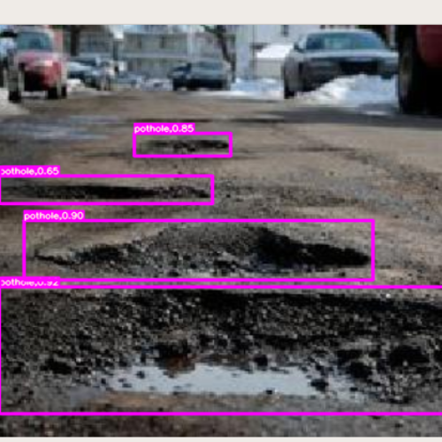
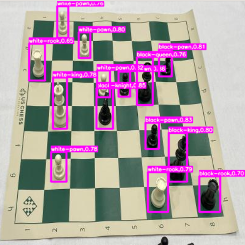
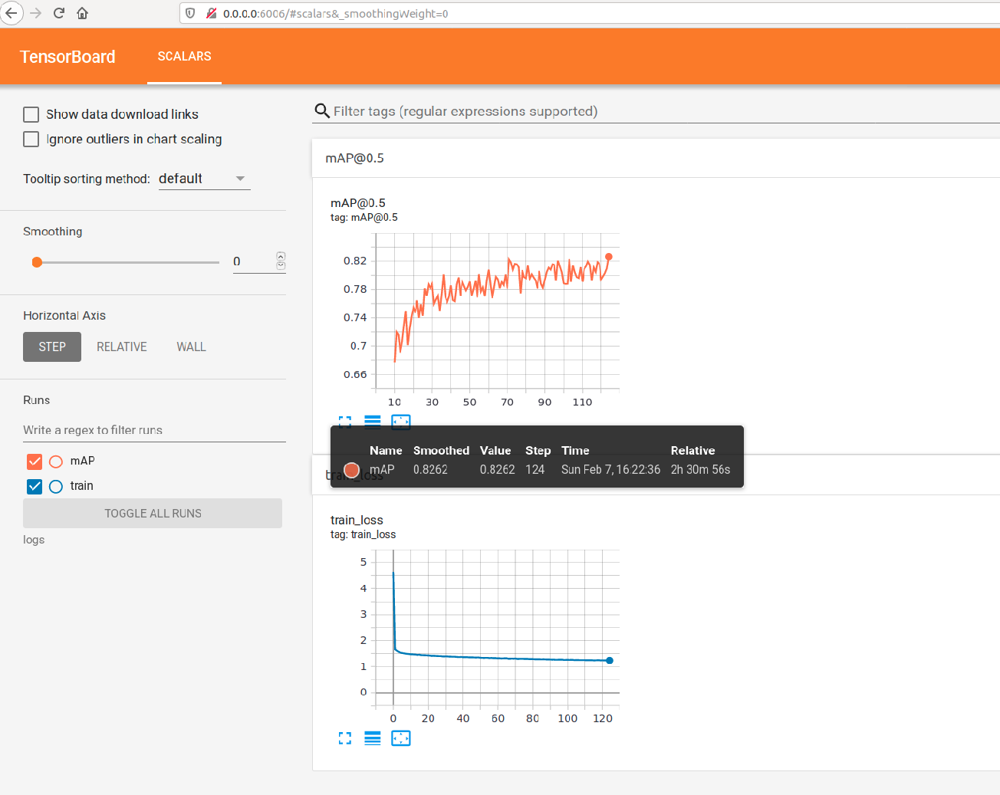
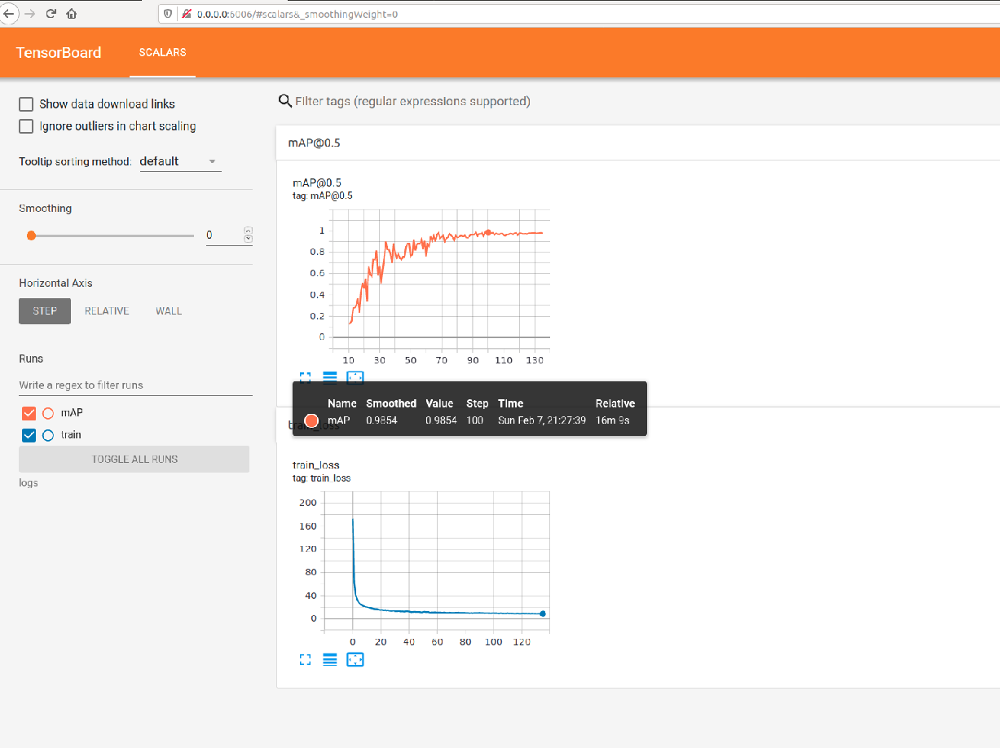
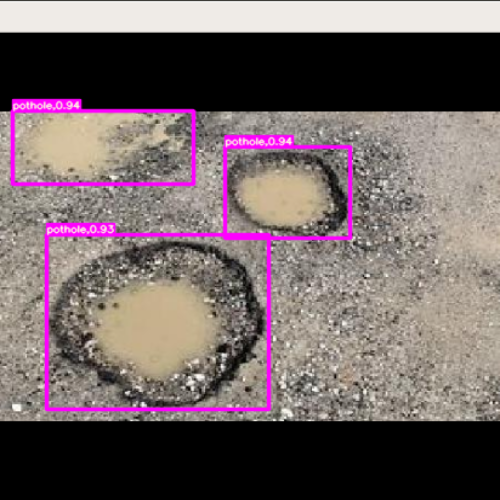

# Scaled-YOLOv4-tensorflow2
A Tensorflow2.x implementation of Scaled-YOLOv4 as described in [Scaled-YOLOv4: Scaling Cross Stage Partial Network](https://arxiv.org/abs/2011.08036)

## Demo



## Features
- [x] yolov4-tiny
- [x] yolov4-large p5
- [x] yolov4-large p6
- [x] yolov4-large p7
- [x] online coco evaluation
- [x] multi scale training
- [x] accumulate gradients for using big batch size
- [x] scales_x_y/eliminate grid sensitivity
- [x] focal loss,diou loss,ciou loss
- [x] mosaic,ssd_random_crop
- [x] hard-nms,DIoU-nms
- [x] label_smooth,warmup,Cosine annealing scheduler
- [x] Eager mode training with tf.GradientTape
- [x] support voc dataset format,coco dataset format
- [x] support transfer learning
- [x] tensorboard
- [ ] one stop deployment using tensorflow Serving
- [ ] support tflite
- [ ] support tensorRT(trt)


## Installation
###  1. Clone project
  ``` 
  git clone https://github.com/wangermeng2021/Scaled-YOLOv4-tensorflow2.git
  cd Scaled-YOLOv4-tensorflow2
  ```
###   2. Install environment
* install tesnorflow ( skip this step if it's already installed)
*     pip install -r requirements.txt

## Training:
* Download Pre-trained p5 coco pretrain models and place it under directory 'pretrained/ScaledYOLOV4_p5_coco_pretrain' :<br>
   [https://drive.google.com/file/d/1glOCE3Y5Q5enW3rpVq3SmKDXzaKIw4YL/view?usp=sharing](https://drive.google.com/file/d/1glOCE3Y5Q5enW3rpVq3SmKDXzaKIw4YL/view?usp=sharing) <br>

* Download Pre-trained p6 coco pretrain models and place it under directory 'pretrained/ScaledYOLOV4_p6_coco_pretrain' :<br>
   [https://drive.google.com/file/d/1EymbpgiO6VkCCFdB0zSTv0B9yB6T9Fw1/view?usp=sharing](https://drive.google.com/file/d/1EymbpgiO6VkCCFdB0zSTv0B9yB6T9Fw1/view?usp=sharing) <br>

* Download Pre-trained tiny coco pretrain models and place it under directory 'pretrained/ScaledYOLOV4_tiny_coco_pretrain' :<br>
   [https://drive.google.com/file/d/1x15FN7jCAFwsntaMwmSkkgIzvHXUa7xT/view?usp=sharing](https://drive.google.com/file/d/1x15FN7jCAFwsntaMwmSkkgIzvHXUa7xT/view?usp=sharing) <br>


* For training on [Pothole dataset](https://public.roboflow.com/object-detection/pothole)(No need to download dataset,it's already included in project):
  p5(single scale):
  ```
  python train.py --use-pretrain True --model-type p5 --dataset-type voc --dataset dataset/pothole_voc --num-classes 1 --class-names pothole.names  --voc-train-set dataset_1,train --voc-val-set dataset_1,val  --epochs 200 --batch-size 4 --multi-scale 416 --augment ssd_random_crop 
  ```
  p5(multi scale):
  ```
  python train.py --use-pretrain True --model-type p5 --dataset-type voc --dataset dataset/pothole_voc --num-classes 1 --class-names pothole.names --voc-train-set dataset_1,train --voc-val-set dataset_1,val  --epochs 200 --batch-size 4 --multi-scale 320,352,384,416,448,480,512 --augment ssd_random_crop 
  ```
* For training on [Chess Pieces dataset](https://public.roboflow.com/object-detection/chess-full)(No need to download dataset,it's already included in project):
  tiny(single scale):
  ```
  python train.py --use-pretrain True --model-type tiny --dataset-type voc --dataset dataset/chess_voc --num-classes 12 --class-names chess.names --voc-train-set dataset_1,train --voc-val-set dataset_1,val  --epochs 400 --batch-size 32 --multi-scale 416 --augment ssd_random_crop 
  ```
  tiny(multi scale):
  ```
  python train.py --use-pretrain True --model-type tiny --dataset-type voc --dataset dataset/chess_voc --num-classes 12 --class-names chess.names --voc-train-set dataset_1,train --voc-val-set dataset_1,val  --epochs 400 --batch-size 32 --multi-scale 320,352,384,416,448,480,512 --augment ssd_random_crop

## Tensorboard visualization:
  * Navigate to [http://0.0.0.0:6006](http://0.0.0.0:6006)

## Evaluation results(GTX2080,mAP@0.5):

| model                                               | Chess Pieces | pothole |  VOC  | COCO |
|-----------------------------------------------------|--------------|---------|-------|------|
| Scaled-YoloV4-tiny(416)                             |     0.985    |         |       |      |
| AlexeyAB's YoloV4(416)                              |              |  0.814  |       |      |
| Scaled-YoloV4-p5(416)                               |              |  0.826  |       |      |

* Evaluation on Pothole dataset: 

* Evaluation on chess dataset: 

## Detection
* For detection on Chess Pieces dataset:
  ```
  python3 detect.py --pic-dir images/chess_pictures --model-path output_model/chess/best_model_tiny_0.985/1 --class-names dataset/chess.names --nms-score-threshold 0.1
  ```
  detection result:

  

* For detection on Pothole dataset:
  ```
  python3 detect.py --pic-dir images/pothole_pictures --model-path output_model/pothole/best_model_p5_0.827/1 --class-names dataset/pothole.names --nms-score-threshold 0.1
  ```
  detection result:

  


## Customzied training
* Convert your dataset to Pascal VOC format(you can use labelImg to generate VOC format dataset)
* Generate class names file(such as xxx.names)
* 
  ```
  python train.py --use-pretrain True --model-type p5 --dataset-type voc --dataset your_dataset_root_dir --num-classes num_of_classes --class-names path_of_xxx.names --voc-train-set dataset_1,train --voc-val-set dataset_1,val  --epochs 200 --batch-size 8 --multi-scale 416  --augment ssd_random_crop 
  ```
## References
* [https://github.com/WongKinYiu/ScaledYOLOv4](https://github.com/WongKinYiu/ScaledYOLOv4)
* [https://github.com/ultralytics/yolov5](https://github.com/ultralytics/yolov5)
* [https://github.com/dmlc/gluon-cv](https://github.com/dmlc/gluon-cv)


