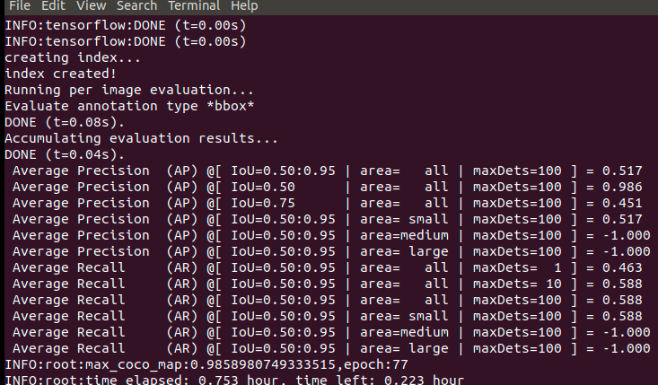

# Features
- [x] yolov4-large p5
- [x] yolov4-large p6
- [x] yolov4-large p7
- [x] scales_x_y/eliminate grid sensitivity
- [x] label_smooth
- [x] warmup
- [x] focal loss
- [x] diou loss
- [x] ciou loss
- [x] multi scale training
- [x] mosaic
- [x] DIoU-NMS
- [x] online coco evaluation
- [x] Cosine annealing scheduler
- [x] accumulate gradients for using big batch size
- [x] Eager mode training with tf.GradientTape
- [x] support voc dataset format
- [x] support coco dataset format(Not yet tested)
- [x] mosaic
- [x] ssd_random_crop
- [x] multi scale training
- [x] label smooth
- [x] convert yolov4-large p5 coco pretrain weight to tensorflow format
- [ ] convert yolov4-large p6 coco pretrain weight to tensorflow format
- [ ] convert yolov4-large p7 coco pretrain weight to tensorflow format
- [ ] yolov4-csp
- [ ] yolov4-tiny
- [ ] Tensorflow Serving

# Scaled-YOLOv4-tensorflow2
A Tensorflow2.x implementation of Scaled-YOLOv4 as described in [Scaled-YOLOv4: Scaling Cross Stage Partial Network](https://arxiv.org/abs/2011.08036)

## Installation
###  1. Clone project
  ``` 
  git clone https://github.com/wangermeng2021/Scaled-YOLOv4-tensorflow2.git
  cd Scaled-YOLOv4-tensorflow2
  ```

###   2. Install environment
* install tesnorflow ( skip this step if it's already installed)
*     pip install -r requirements.txt

## Training(GTX1070):
* Download Pre-trained coco models and place it under directory pretrained/ScaledYOLOV4_p5_coco_pretrain :<br>
   [https://drive.google.com/file/d/1glOCE3Y5Q5enW3rpVq3SmKDXzaKIw4YL/view?usp=sharing](https://drive.google.com/file/d/1glOCE3Y5Q5enW3rpVq3SmKDXzaKIw4YL/view?usp=sharing) <br>
   or<br>
   [https://pan.baidu.com/s/1EBIMaBzEYA7ZT1yuWHmi-w](https://pan.baidu.com/s/1EBIMaBzEYA7ZT1yuWHmi-w) password: 9yc8 
* For training on [Chess Pieces dataset](https://public.roboflow.com/object-detection/chess-full)(No need to download dataset,it's already included in project):
  
  single scale:
  ```
  python train.py --dataset dataset/chess_voc  --epochs 300 --batch-size 8 --multi-scale 416
  ```
  multi scale:
  ```
  python train.py --dataset dataset/chess_voc  --epochs 300 --batch-size 8 --multi-scale 416,512,640
  ```
## Evaluation results(GTX1070,mAP@0.5,batch_size=4,single scale):

| model                           | Chess Pieces | VOC | COCO |
|---------------------------------|--------------|-----|------|
| YoloV3(352x352)                 |     0.953    |     |      |
| Scaled-YoloV4-large-p5(352x352) |     0.986    |     |      |

 

## detection
* For detection on Chess Pieces dataset:
  ```
  python3 detect.py
  ```
  detection result:

  

## customzied training
* Convert your dataset to Pascal VOC format(you can use labelImg to generate VOC format dataset)
* Generate class names file(such as xxx.names)
* 
  ```
  python train.py --dataset your_dataset_root_dir --num-classes num_of_classes --class-names path_of_xxx.names --epochs 300 --batch-size 8 --multi-scale 416
  ```
## References
* [https://github.com/WongKinYiu/ScaledYOLOv4](https://github.com/WongKinYiu/ScaledYOLOv4)
* [https://github.com/ultralytics/yolov5](https://github.com/ultralytics/yolov5)
* [https://github.com/tensorflow/models](https://github.com/tensorflow/models)


